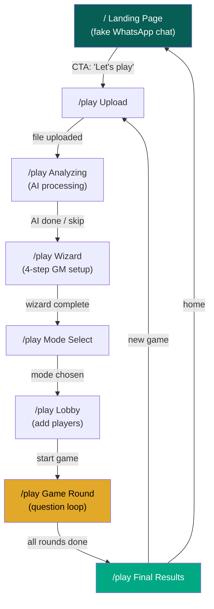
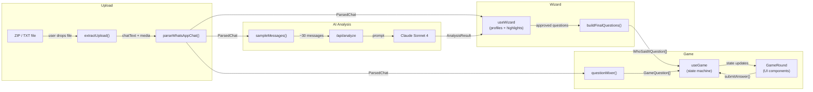

# PROJECT-MAP

> **ChatLoot** — Turn any WhatsApp group chat into a multiplayer trivia game, powered by AI

| Stack | |
|-------|---|
| Framework | Next.js 16 (App Router) |
| UI | React 19, Tailwind CSS 4, shadcn/ui, Framer Motion |
| AI | Claude Sonnet 4 (Anthropic SDK) |
| Language | TypeScript 5 |
| Parsing | jszip, whatsapp-chat-parser, @vladmandic/human (face detection) |
| Deploy | Vercel |

---

## Directory Map

```
src/
├── app/                              # Next.js App Router
│   ├── page.tsx                      # Landing — fake WhatsApp chat intro
│   ├── layout.tsx                    # Root layout (RTL, Rubik font, Toaster)
│   ├── play/
│   │   └── page.tsx                  # Main game orchestrator (5 flow phases)
│   ├── upload/
│   │   └── page.tsx                  # Standalone upload + preview
│   └── api/
│       └── analyze/
│           └── route.ts              # POST — Claude AI chat analysis
│
├── components/
│   ├── ui/                           # shadcn/ui primitives (button, card, dialog, etc.)
│   ├── game/                         # Game phase components
│   │   ├── upload-step.tsx           # File drop/upload UI
│   │   ├── lobby-step.tsx            # Player join screen
│   │   ├── mode-select.tsx           # Choose game mode
│   │   ├── game-round.tsx            # Question → answer → reveal loop
│   │   ├── final-results.tsx         # End-game scoreboard
│   │   └── superlatives.tsx          # Awards/recognition UI
│   ├── wizard/                       # GM setup wizard (4 steps)
│   │   ├── gm-setup.tsx             # Multi-step wizard container
│   │   ├── group-reveal.tsx         # Show parsed group info
│   │   ├── member-cards.tsx         # Edit member profiles
│   │   ├── photo-matcher.tsx        # Face detection + photo tagging
│   │   └── highlights-review.tsx    # Approve/edit AI questions
│   ├── shared/
│   │   └── chat-bubble.tsx          # WhatsApp-style message bubble
│   └── upload/
│       └── parsed-results.tsx       # Chat parse preview
│
├── hooks/
│   ├── use-game.ts                  # Game state machine (phases, scoring, rounds)
│   ├── use-wizard.ts                # Wizard state (profiles, highlights, photos)
│   └── use-timer.ts                 # Countdown timer for rounds
│
├── lib/
│   ├── parser/                      # WhatsApp chat extraction
│   │   ├── types.ts                 # ParsedChat, ParsedMessage, ChatMember, MemberStats
│   │   ├── extract-files.ts         # Unzip + extract .txt & media from zip
│   │   ├── parse-chat.ts            # Regex-parse WhatsApp text format
│   │   └── extract-stats.ts         # Calculate per-member statistics
│   ├── game/                        # Game engine
│   │   ├── types.ts                 # GameState, GameQuestion (7 types), Player, modes
│   │   ├── question-mixer.ts        # Mix question types (50% who-said-it, 50% variety)
│   │   ├── scoring.ts               # Score calc (speed bonus + streak bonus)
│   │   └── modes/                   # One file per question type generator
│   │       ├── who-said-it.ts
│   │       ├── stat-trivia.ts
│   │       ├── emoji-match.ts
│   │       ├── true-false.ts
│   │       ├── word-cloud.ts
│   │       ├── time-guess.ts
│   │       └── ghost-detective.ts
│   ├── ai/                          # Claude AI integration
│   │   ├── analyze-chat.ts          # Client-side: fetch /api/analyze, parse result
│   │   ├── types.ts                 # Zod schemas (AnalyzeRequest, AnalyzeResponse)
│   │   ├── prompt.ts                # Build Claude prompt from chat data
│   │   └── sample-messages.ts       # Sample ~30 interesting messages for AI
│   ├── wizard/                      # Member profile & photo logic
│   │   ├── types.ts                 # MemberProfile, HighlightCard, WizardState
│   │   ├── personality.ts           # Assign personality templates + sample messages
│   │   ├── face-scanner.ts          # Face detection via @vladmandic/human
│   │   └── photo-utils.ts           # Image cropping, blob handling
│   ├── i18n/
│   │   ├── types.ts                 # Translation key types
│   │   └── he.ts                    # Hebrew strings (only language)
│   ├── haptics.ts                   # navigator.vibrate() wrappers
│   ├── sounds.ts                    # Audio playback (correct, wrong, reveal, tick)
│   ├── share.ts                     # Share results (URL encoding, social)
│   └── utils.ts                     # Helpers (shuffle, cn, etc.)
```

---

## Quick Reference

| Feature / Concept | File(s) | Notes |
|---|---|---|
| Landing page | `src/app/page.tsx` | Fake WhatsApp chat with animated bubbles |
| Main game flow | `src/app/play/page.tsx` | Orchestrates all 5 phases (upload → game) |
| AI analysis endpoint | `src/app/api/analyze/route.ts` | Rate-limited, Zod-validated, calls Claude |
| AI client call | `src/lib/ai/analyze-chat.ts` | Fetches `/api/analyze`, returns `AnalysisResult` |
| AI prompt builder | `src/lib/ai/prompt.ts` | Constructs the Claude prompt from chat data |
| Chat parsing | `src/lib/parser/parse-chat.ts` | Regex-parses WhatsApp export text |
| File extraction | `src/lib/parser/extract-files.ts` | Unzips uploaded .zip, extracts media |
| Stats calculation | `src/lib/parser/extract-stats.ts` | Computes per-member stats from messages |
| Question generation | `src/lib/game/question-mixer.ts` | Mixes 7 question types into a round pool |
| Scoring logic | `src/lib/game/scoring.ts` | Speed bonus + streak bonus formula |
| Game round UI | `src/components/game/game-round.tsx` | Question display, answer buttons, reveal |
| Upload UI | `src/components/game/upload-step.tsx` | File drop zone + progress |
| Player lobby | `src/components/game/lobby-step.tsx` | Add player names before game |
| Mode selection | `src/components/game/mode-select.tsx` | Choose game mode |
| Final scoreboard | `src/components/game/final-results.tsx` | Rankings + awards |
| Wizard container | `src/components/wizard/gm-setup.tsx` | 4-step setup wizard |
| Member editor | `src/components/wizard/member-cards.tsx` | Edit names, view stats |
| Photo matching | `src/components/wizard/photo-matcher.tsx` | Face detection + tag photos to members |
| Highlights review | `src/components/wizard/highlights-review.tsx` | Approve/edit AI-picked questions |
| Face detection | `src/lib/wizard/face-scanner.ts` | @vladmandic/human face detection |
| Sound effects | `src/lib/sounds.ts` | Play correct/wrong/reveal/tick sounds |
| Haptic feedback | `src/lib/haptics.ts` | Vibrate on correct/wrong answers |
| Hebrew translations | `src/lib/i18n/he.ts` | All UI strings |

### Key Hooks

| Hook | Purpose | Key State |
|---|---|---|
| `useGame` | Game state machine | `phase`: GamePhase, `players`: Player[], `currentRound`, `currentQuestion` |
| `useWizard` | Member profiles + highlight cards | `profiles`: MemberProfile[], `highlights`: HighlightCard[], `currentStep`: 1-4 |
| `useTimer` | Countdown timer per round | `timeLeft`: number, `isRunning`: boolean, `progress`: 0-1 |

### Key Types

| Type | Defined In | Used By |
|---|---|---|
| `ParsedChat` | `src/lib/parser/types.ts` | play/page, useWizard, analyzeChat |
| `GameState` | `src/lib/game/types.ts` | useGame |
| `GameQuestion` | `src/lib/game/types.ts` | useGame, game-round, question-mixer |
| `GamePhase` | `src/lib/game/types.ts` | useGame, play/page (7 phases: setup→lobby→question→answering→reveal→scores→final) |
| `FlowPhase` | `src/app/play/page.tsx` | play/page (5 phases: upload→analyzing→wizard→mode-select→game) |
| `MemberProfile` | `src/lib/wizard/types.ts` | useWizard, member-cards, photo-matcher |
| `HighlightCard` | `src/lib/wizard/types.ts` | useWizard, highlights-review |
| `AnalysisResult` | `src/lib/ai/analyze-chat.ts` | play/page, useWizard |
| `Player` | `src/lib/game/types.ts` | useGame, lobby-step, game-round |
| `WhoSaidItQuestion` | `src/lib/game/types.ts` | AI analysis, wizard, question-mixer |

---

## Screen Map



> All screens live inside `/play` — the `FlowPhase` state machine in `play/page.tsx` controls which component renders. Only the landing page (`/`) is a separate route.

---

## Screen Details

### Landing Page (`/`)

**Purpose:** Introduce ChatLoot through an animated fake WhatsApp group conversation

| # | Action | Triggers | Component |
|---|--------|----------|-----------|
| 1 | Watch chat animation | Messages appear one-by-one with typing indicators | `LandingPage` (inline) |
| 2 | Click "Let's play" CTA | Navigate to `/play` | `Link` to `/play` |

### Upload Phase (`/play`, flowPhase=`upload`)

**Purpose:** User drops or selects their exported WhatsApp chat file

| # | Action | Triggers | Component |
|---|--------|----------|-----------|
| 1 | Drop/select .zip or .txt | `extractUpload()` → `parseWhatsAppChat()` → transitions to `analyzing` | `UploadStep` |
| 2 | Select folder (multi-file) | Same pipeline, reads from FileList | `UploadStep` |

### Analyzing Phase (`/play`, flowPhase=`analyzing`)

**Purpose:** Claude AI reads the chat and picks the best questions

| # | Action | Triggers | Component |
|---|--------|----------|-----------|
| 1 | Wait for AI | `analyzeChat()` calls `/api/analyze`, rotating loading messages | inline in `PlayPage` |
| 2 | Skip AI | Sets analysis to null, goes to wizard with fallback mode | `handleSkipAi()` |

### Wizard Phase (`/play`, flowPhase=`wizard`)

**Purpose:** GM reviews members, tags photos, and approves AI-picked questions (4 steps)

| # | Action | Triggers | Component |
|---|--------|----------|-----------|
| 1 | Step 1: Review group info | Shows parsed group name, member count, date range | `GroupReveal` |
| 2 | Step 2: Edit member profiles | Set nicknames, merge duplicate members | `MemberCards` |
| 3 | Step 3: Tag photos | Face detection matches photos to members | `PhotoMatcher` |
| 4 | Step 4: Approve highlights | Toggle AI questions on/off, edit GM notes | `HighlightsReview` |
| 5 | Complete wizard | Builds final questions, collects photo map → `mode-select` | `GmSetup.handleComplete()` |

### Mode Select (`/play`, flowPhase=`mode-select`)

**Purpose:** Choose game mode before starting

| # | Action | Triggers | Component |
|---|--------|----------|-----------|
| 1 | Select game mode | Calls `game.initGame()` with questions → transitions to `game` | `ModeSelect` |

### Lobby (`/play`, flowPhase=`game`, phase=`lobby`)

**Purpose:** Add player names before the game starts

| # | Action | Triggers | Component |
|---|--------|----------|-----------|
| 1 | Add player name | `game.addPlayer(name)` — assigns color + avatar | `LobbyStep` |
| 2 | Remove player | `game.removePlayer(id)` | `LobbyStep` |
| 3 | Start game | `game.startGame()` → loads first question | `LobbyStep` |

### Game Round (`/play`, flowPhase=`game`, phase=`question`→`answering`→`reveal`→`scores`)

**Purpose:** The trivia loop — show question, collect answers, reveal, score

| # | Action | Triggers | Component |
|---|--------|----------|-----------|
| 1 | View question (2s dramatic pause) | Auto-transitions to `answering` via `game.showQuestion()` | `GameRound` |
| 2 | Tap answer | `game.submitAnswer()` → calculates score (speed + streak bonus) | `GameRound` |
| 3 | Timer expires | Auto-reveals answer via `game.revealAnswer()` | `useTimer` → `GameRound` |
| 4 | View reveal | Shows correct answer + confetti/haptics if correct | `GameRound` |
| 5 | Next round / scoreboard | `game.nextRound()` or `game.showScores()` (every 3 rounds) | `GameRound` |

### Final Results (`/play`, flowPhase=`game`, phase=`final`)

**Purpose:** End-game scoreboard with rankings and awards

| # | Action | Triggers | Component |
|---|--------|----------|-----------|
| 1 | View rankings | Displays players sorted by score | `FinalResults` |
| 2 | View superlatives | Awards like "fastest player", "streak king" | `Superlatives` |
| 3 | New game | `game.reset()` → back to upload phase | `FinalResults` |
| 4 | Go home | Navigate to `/` | `FinalResults` |

---

## Data Flow



### Main Data Pipeline

1. **Upload** — User drops a `.zip` or `.txt` file. `extractUpload()` in `src/lib/parser/extract-files.ts` unzips it, extracts `_chat.txt` and media files
2. **Parse** — `parseWhatsAppChat()` in `src/lib/parser/parse-chat.ts` regex-parses messages, builds member list and stats → returns `ParsedChat`
3. **AI Analyze** — `analyzeChat()` in `src/lib/ai/analyze-chat.ts` samples ~30 messages, POSTs to `/api/analyze`, which calls Claude Sonnet 4 → returns `AnalysisResult` (ranked questions + member summaries)
4. **Wizard** — `useWizard` loads member profiles from `ParsedChat` + AI summaries. GM edits names, tags photos, approves highlights. `buildFinalQuestions()` outputs the curated `WhoSaidItQuestion[]`
5. **Game** — `useGame.initGame()` takes `ParsedChat` + curated questions. `questionMixer` generates a diverse pool of 7 question types. The game state machine cycles through question → answering → reveal → scores → next round
6. **Render** — `GameRound` reads `game.state` and renders the current phase with animations, haptics, and sound effects

---

## State Management

| State Domain | Owner | Key Variables | Persisted? |
|---|---|---|---|
| Flow phase | `play/page.tsx` (local state) | `flowPhase`: upload → analyzing → wizard → mode-select → game | No |
| Parsed chat data | `play/page.tsx` (local state) | `chat`: ParsedChat, `analysis`: AnalysisResult | No |
| Member photos | `play/page.tsx` (local state) | `memberPhotos`: Map\<name, url\> | No |
| Wizard | `useWizard` hook | `profiles`: MemberProfile[], `highlights`: HighlightCard[], `currentStep`: 1-4 | No |
| Game engine | `useGame` hook | `phase`: GamePhase, `players`: Player[], `currentRound`, `currentQuestion`, `roundResults` | No |
| Round timer | `useTimer` hook | `timeLeft`, `isRunning`, `progress` | No |
| Sound mute | `play/page.tsx` + `sounds.ts` | `muted`: boolean (via `getMuted()`/`setMuted()`) | No |

> Everything is client-side, in-memory. No database, no localStorage. Refreshing the page resets everything.

---

## API Map

| Method | Path | Purpose | Request | Response |
|--------|------|---------|---------|----------|
| `POST` | `/api/analyze` | Analyze chat with Claude AI | `{ messages, members, groupName }` — see `AnalyzeRequestSchema` in `src/lib/ai/types.ts` | `{ rankedMessages, memberProfiles }` — see `AnalyzeResponseSchema` in `src/lib/ai/types.ts` |

**Rate limits:** 5 req/min per IP, 100 req/min global. Returns 429 or 503 on limit.

**AI model:** `claude-sonnet-4-20250514`, max 8192 tokens.

---

## Key Concepts

| Term | Meaning | In Code |
|------|---------|---------|
| Flow Phase | The 5 top-level stages of `/play` (upload → analyzing → wizard → mode-select → game) | `FlowPhase` type in `src/app/play/page.tsx` |
| Game Phase | The 7 states within the game engine (setup → lobby → question → answering → reveal → scores → final) | `GamePhase` type in `src/lib/game/types.ts` |
| GM (Game Master) | The person who uploaded the chat and curates questions in the wizard | Referenced in `gm-setup.tsx`, `gmNote` fields |
| Wizard | 4-step setup where GM reviews members, tags photos, approves questions | `useWizard` hook, `src/components/wizard/` |
| Highlight | An AI-scored chat message selected as a potential game question | `HighlightCard` type in `src/lib/wizard/types.ts` |
| Question Mixer | System that blends 7 question types into a balanced round pool | `generateMixedQuestions()` in `src/lib/game/question-mixer.ts` |
| Question Types | 7 types: who_said_it, stat_trivia, emoji_match, true_false, word_cloud, time_guess, ghost_detective | `QuestionType` in `src/lib/game/types.ts`, generators in `src/lib/game/modes/` |
| Member Profile | Enriched member data: stats + personality + photos + AI summary | `MemberProfile` in `src/lib/wizard/types.ts` |
| Personality | Auto-assigned title + emoji + summary based on member stats | `assignPersonalities()` in `src/lib/wizard/personality.ts` |
| Superlatives | End-game awards (e.g., "fastest player", "streak king") | `Superlatives` component in `src/components/game/superlatives.tsx` |
| RTL | Right-to-left layout — the entire app is in Hebrew | Set in `layout.tsx` via `dir="rtl"`, font: Rubik |

---

## Environment & Setup

### Required Environment Variables

| Variable | Purpose | Where to Get It |
|----------|---------|-----------------|
| `ANTHROPIC_API_KEY` | Claude AI API key for chat analysis | [console.anthropic.com](https://console.anthropic.com) > API Keys |

### Local Dev

```bash
npm install
cp .env.example .env.local   # Add your ANTHROPIC_API_KEY
npm run dev                   # http://localhost:3000
```

---

## Maintenance Guide

### When to Update This Doc

- **Added a new page/route?** Update Screen Map + Screen Details + Directory Map
- **Added a new hook?** Update Quick Reference > Key Hooks + State Management
- **Added a new API route?** Update API Map
- **Added a new question type?** Update Key Concepts (Question Types) + Directory Map (modes/)
- **Added a new domain concept?** Update Key Concepts
- **Moved/renamed files?** Update Quick Reference + Directory Map
- **Changed data flow?** Update Data Flow diagram
- **Added env vars?** Update Environment & Setup

### Conventions

- Keep the Quick Reference table sorted by feature name
- Screen Details: max 5 actions per screen — if you need more, the screen does too much
- Mermaid diagrams: short labels, details go in the tables below
- File paths start from `src/` (omit the repo root)
- Update this doc in the **same commit** as the code change

### AI Agent Notes

- This doc is the source of truth for "where is the code for X"
- Use the Quick Reference table first before searching the filesystem
- **Two state machines control the app:** `FlowPhase` (5 phases in play/page.tsx) and `GamePhase` (7 phases in useGame). Don't confuse them
- Type definitions live in `types.ts` within each domain directory
- Components: `src/components/{feature}/{component-name}.tsx`
- Hooks: `src/hooks/use-{name}.ts`
- Lib modules: `src/lib/{domain}/{module}.ts`
- Question type generators: `src/lib/game/modes/{type-name}.ts`
- Everything is client-side — no database, no auth, no server state
